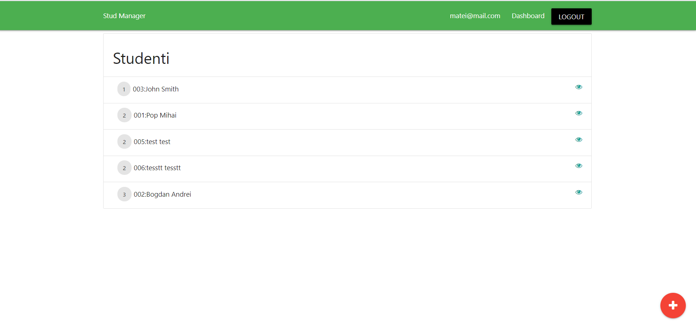

### Acest folder:

Contine o aplicatie de management a studentilor creata cu framework-ul Vue.js. Deoarece github pages permite doar afisarea paginilor statice aplicatia nu se poate deschide decat de pe localhost sau daca este incarcata pe un site de host (ex:  DigitalOcean).

Nume proiect: Stud Manager

Autor: Capilnas Matei-Vasile

Descriere: Aplicatia se ocupa cu gestiunea studentilor. Contine o sectiune de login/register, un dashboard cu numele studentilor si anul in care acestia sunt, se poate accesa fiecare student pentru a-i fi modificate datele si se pot adauga un student nou.

Build: Pentru web. E nevoie de instalarea vue.js-ului si initializarea unui server local.

Foloseste: firebase database, vue.js, CSS

### Materiale ajutatoare

https://www.youtube.com/watch?v=5lVQgZzLMHc - punct de plecare pentru aplicatia creata in Vue.js

https://www.youtube.com/watch?v=Wy9q22isx3U&t=1286s - punct de plecare pentru aplicatia creata in Vue.js.
