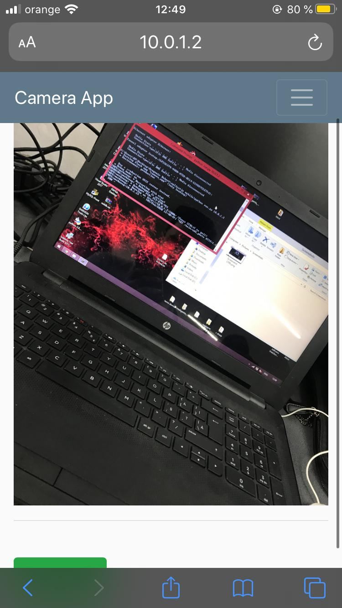

# camera-app
 
am folosit:

python: flask, sqlalchemy, wtforms
javascript: jquery
sqlite

autor : Dragomir Robert-Simion

Descriere: aplicatie care face poze si le adauga intr o baza de date sau poti adauga poze ditrect dintr-un fisier.

Folosire: cd in proiect executa python run.py + ip-u de pe care e facut host

