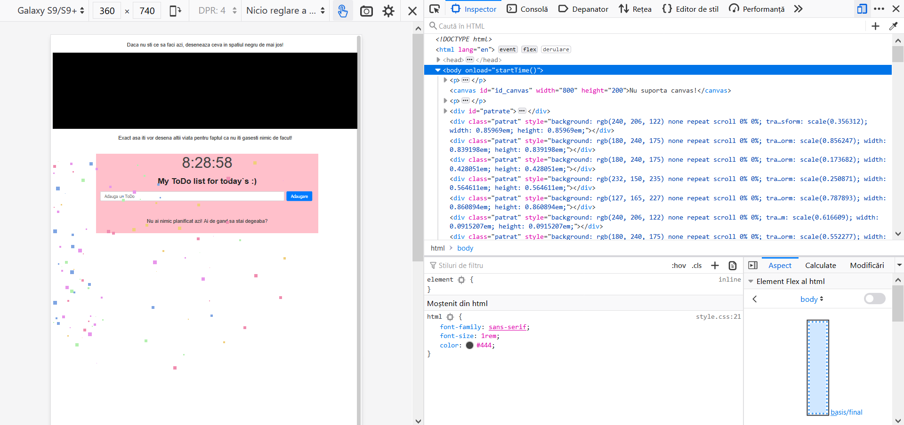
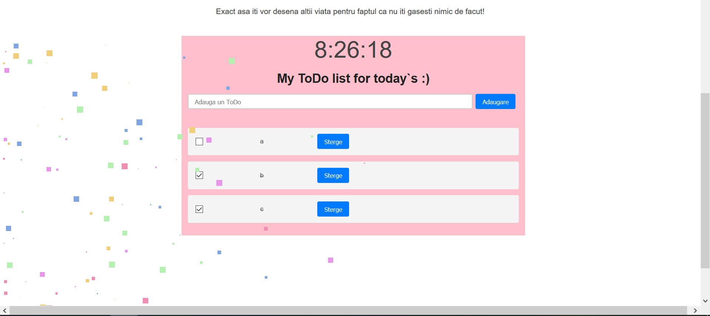
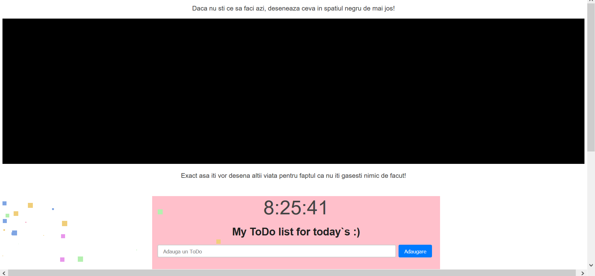

# Proiect final 

Nume proiect: My to do list for today`s

Autor: Hanches Otilia

Descriere: Aplicatie web prin care un user poate sa isi seteze anumite taskuri pe care mai apoi sa le indeplineasca. Aplicatia contine functii precum adaugarea, stergerea si editarea unui task.

Pe ce sistem de operare ruleaza: Windows

Tehnologii folosite (inclusiv biblioteci externe): HTML5, CSS. JavaScript

Cerinte hardware minimale: -

Bucati de cod din alte proiecte: 
- https://github.com/oti-a2j/oti-a2j.github.io/tree/master/HTML/TOUCH -> cod pentru senzor tactil (preluat din laboratoarele de programarea dispozitivelor mobile, materie parcursa in sem 1, INFO III)
- https://www.cssscript.com/animated-particles-background-pure-javascript/ -> cod preluat partial
- stackoverflow -> m-am inspirat pentru diferite situatii, bugg-uri

Screenshot-uri:

