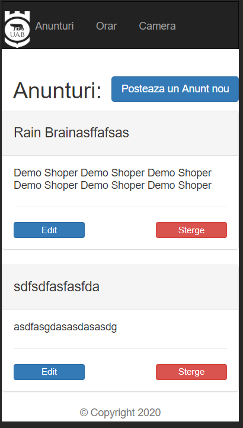

# UAB Info anul III
Aplicatie simpla pentru comunicarea informatiilor intre colegii de facultate
## Getting Started
### Instalation Requirements
node.js 
npm 
### Instalation 
cd UAB_Info_anul_III
npm install
### Run
npm start 
### Autor:
Nastas Daniel   
### Pe ce sistem de operare ruleaza: 
Web Aplication
### Tehnologii folosite :
bootstrap 3 -framework UI
Node.js limbaj de programare
Express.js Framework 
webcam Framework 
MySQL - baza de date
Ejs - Template Engine 

