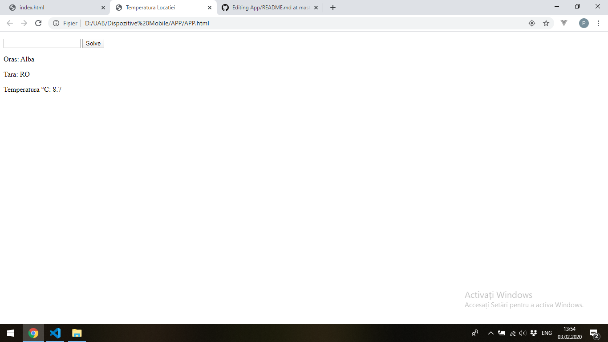
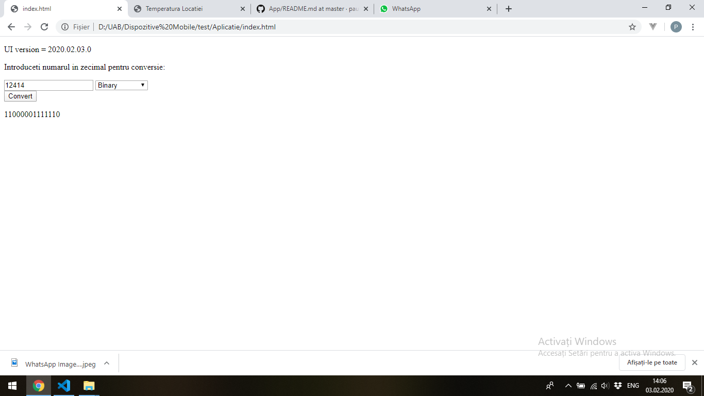

# App
Titlu : Conversie numere
Teoc Paul Eugen

Este vorba de o aplicatie care converteste numerele in binar ,hexadecimal si octal.
Am ajuns la aplicatia aceasta deoarece a am putut sa o implementez ca MVC, initial am vrut sa folosesc un senzor GPS al telefonului
am reusit aceasta putand afisa locatia ,temperatura si alte aspecte legate de locatie, dar dupa incercarea de a transforma aplicatia in MVC am intampinat unele dificultati in definirea valorilor, acestea fiind definite dar apoi sterse in urma solicitarii locatiei de catre telefon.

Aplicatia a fost implementata folosind modelul MVC studiat in cadrul laboratoarelor ,impartind codul in 4 clase, Events care se acceseaza la apasarea butonului click, Model in care se declara functiile si se apeleaza cu Ajutorul Controllerului, rezultatul fiind returnat si salvat pentru a fi trimis in clasa View pentru afisare

